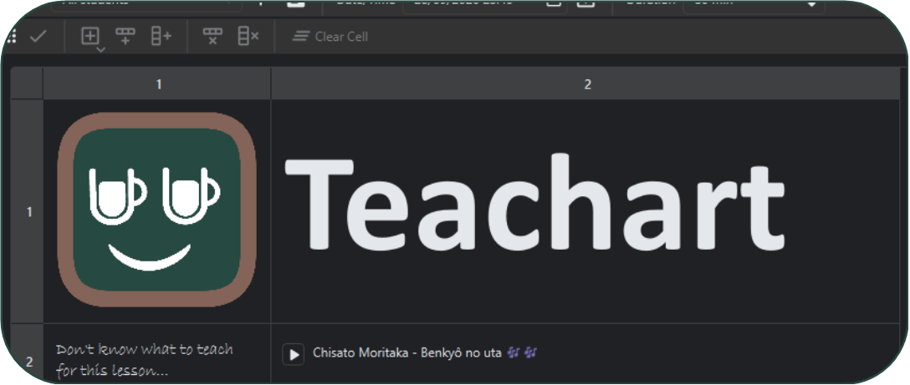

  

 

  
  
  

 
Teachart is a Qt application written in Python for creating lesson plans in a rich table structure that can hold any information you need for the lesson.
The document looks like an typical spreadsheet that can extend by rows and columns but instead of holding numbers and plain text it can hold rich text, images and even audio files. Furthermore, you can organise your courses and students as well as save schedules to you lesson plans.
